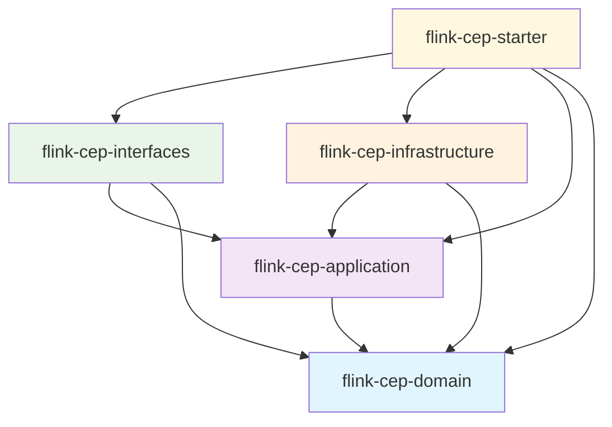

# 🏗️ FlinkAPI CEP - Maven 멀티모듈 구조 가이드

## 📋 개요

**FlinkAPI CEP 라이브러리**는 **DDD(Domain-Driven Design)** 아키텍처 원칙을 따르는 **Maven 멀티모듈 프로젝트**로 설계되었습니다. 각 레이어가 독립적인 JAR 모듈로 분리되어 있어 필요한 부분만 선택적으로 사용할 수 있습니다.

## 🏛️ 모듈 구조

```
flink-cep-parent (pom)
├── flink-cep-domain (jar)        # 🏛️ 도메인 레이어
├── flink-cep-application (jar)   # 🎮 응용 레이어
├── flink-cep-infrastructure (jar) # 🔧 인프라 레이어
├── flink-cep-interfaces (jar)    # 🌐 인터페이스 레이어
└── flink-cep-starter (jar)       # 🚀 올인원 스타터
```

### 📦 각 모듈 설명

#### 🏛️ flink-cep-domain
- **역할**: 핵심 비즈니스 로직과 도메인 모델
- **포함**: Event, Rule, 도메인 서비스, 값 객체
- **의존성**: 없음 (순수 비즈니스 로직)

```xml
<dependency>
    <groupId>com.flinkapi</groupId>
    <artifactId>flink-cep-domain</artifactId>
    <version>1.0.0</version>
</dependency>
```

#### 🎮 flink-cep-application
- **역할**: 유스케이스와 응용 서비스 구현
- **포함**: 응용 서비스, DTO, 포트 인터페이스
- **의존성**: flink-cep-domain

```xml
<dependency>
    <groupId>com.flinkapi</groupId>
    <artifactId>flink-cep-application</artifactId>
    <version>1.0.0</version>
</dependency>
```

#### 🔧 flink-cep-infrastructure
- **역할**: 외부 시스템 연동 및 기술적 구현
- **포함**: Flink 스트림 프로세서, 외부 API 연동
- **의존성**: flink-cep-domain, flink-cep-application

```xml
<dependency>
    <groupId>com.flinkapi</groupId>
    <artifactId>flink-cep-infrastructure</artifactId>
    <version>1.0.0</version>
</dependency>
```

#### 🌐 flink-cep-interfaces
- **역할**: 웹 API 및 외부 인터페이스
- **포함**: REST 컨트롤러, API 응답 모델
- **의존성**: flink-cep-domain, flink-cep-application

```xml
<dependency>
    <groupId>com.flinkapi</groupId>
    <artifactId>flink-cep-interfaces</artifactId>
    <version>1.0.0</version>
</dependency>
```

#### 🚀 flink-cep-starter
- **역할**: 모든 모듈을 포함하는 편의성 패키지
- **포함**: 통합 애플리케이션 클래스, 예제 코드
- **의존성**: 모든 모듈

```xml
<dependency>
    <groupId>com.flinkapi</groupId>
    <artifactId>flink-cep-starter</artifactId>
    <version>1.0.0</version>
</dependency>
```

## 빌드 및 사용 방법

### 전체 빌드

```bash
# 루트 디렉토리에서 전체 모듈 빌드
mvn clean install

# 특정 모듈만 빌드
mvn clean install -pl flink-cep-domain
```

### 🎯 선택적 사용 (모듈별 import)

각 프로젝트의 필요에 따라 필요한 모듈만 선택적으로 사용할 수 있습니다:

#### 1️ 최소 구성 (도메인만)
```xml
<dependency>
    <groupId>com.flinkapi</groupId>
    <artifactId>flink-cep-domain</artifactId>
    <version>1.0.0</version>
</dependency>
```

#### 2️ 비즈니스 로직 + 응용 서비스
```xml
<dependency>
    <groupId>com.flinkapi</groupId>
    <artifactId>flink-cep-application</artifactId>
    <version>1.0.0</version>
</dependency>
```

#### 3️ 완전한 구성 (올인원)
```xml
<dependency>
    <groupId>com.flinkapi</groupId>
    <artifactId>flink-cep-starter</artifactId>
    <version>1.0.0</version>
</dependency>
```

## 🎨 사용 예제

### 기본 도메인 사용 (Domain Only)

```java
import com.flinkapi.cep.domain.model.Event;
import com.flinkapi.cep.domain.model.Rule;

// 도메인 모델만 사용
Event event = Event.builder()
    .eventId("evt_001")
    .userId("user_123")
    .eventType("transaction")
    .build();

Rule rule = Rule.builder()
    .name("High Amount Transaction")
    .eventType("transaction")
    .build();

// 도메인 로직 실행
boolean matches = rule.canApplyToEvent(event);
```

### 🎮 응용 서비스 사용 (Application Layer)

```java
import com.flinkapi.cep.application.service.RuleManagementService;
import com.flinkapi.cep.application.service.EventStreamingService;

// 응용 서비스 사용 (의존성 주입 필요)
RuleManagementService ruleService = new RuleManagementService(ruleRepo, validationService);
EventStreamingService streamService = new EventStreamingService(eventRepo, ruleRepo, 
    eventProcessingService, streamProcessor);
```

### 🚀 올인원 스타터 사용

```java
import com.flinkapi.cep.FlinkCEPApplication;

// 간단한 시작 방법
FlinkCEPApplication app = FlinkCEPApplication.create();

app.registerRule(sampleRule)
   .startEventStreaming("kafka-source")
   .execute("My CEP Application");
```

## 의존성 그래프



## 🎯 모듈 선택 가이드

| 목적 | 권장 모듈 | 설명 |
|------|----------|------|
| 도메인 모델만 사용 | `flink-cep-domain` | 다른 시스템에서 CEP 도메인 모델을 재사용 |
| 비즈니스 로직 구현 | `flink-cep-application` | 자체 인프라로 CEP 비즈니스 로직 구현 |
| Flink 기반 구현 | `flink-cep-infrastructure` | Flink를 사용한 완전한 CEP 시스템 |
| 웹 API 서버 | `flink-cep-interfaces` | REST API와 함께 CEP 시스템 구축 |
| 빠른 시작 | `flink-cep-starter` | 모든 기능을 포함한 올인원 패키지 |

##  DDD 레이어 규칙

### 허용되는 의존성 방향
- **Interfaces** → **Application** → **Domain**
- **Infrastructure** → **Application** → **Domain**
- **Starter** → 모든 모듈

###  금지되는 의존성 방향
- **Domain** → 다른 레이어 (Domain은 독립적)
- **Application** → **Infrastructure** (인터페이스로 역전)
- **Application** → **Interfaces** (인터페이스로 역전)

##  더 많은 정보

- [DDD 아키텍처 가이드](README-DDD.md)
- [라이브러리 사용법](README-library.md)
- [GitHub Repository](https://github.com/ukulkdin/FlinkAPI)

---

**💡 팁**: 프로젝트 초기에는 `flink-cep-starter`로 시작하고, 나중에 필요에 따라 개별 모듈로 분리하는 것을 권장합니다. 