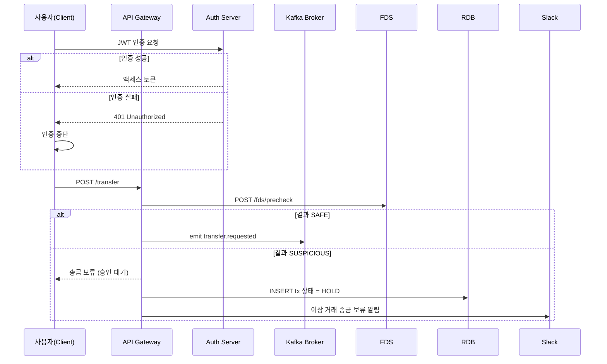
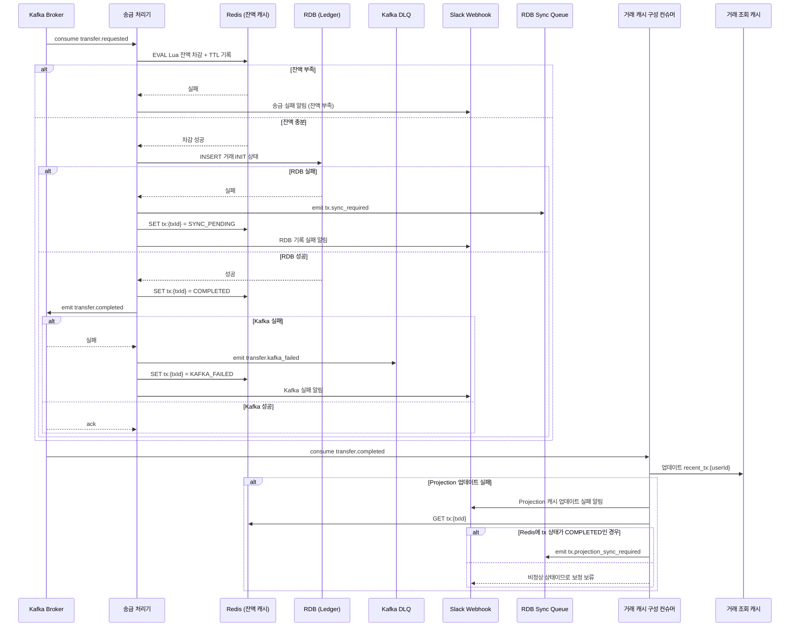
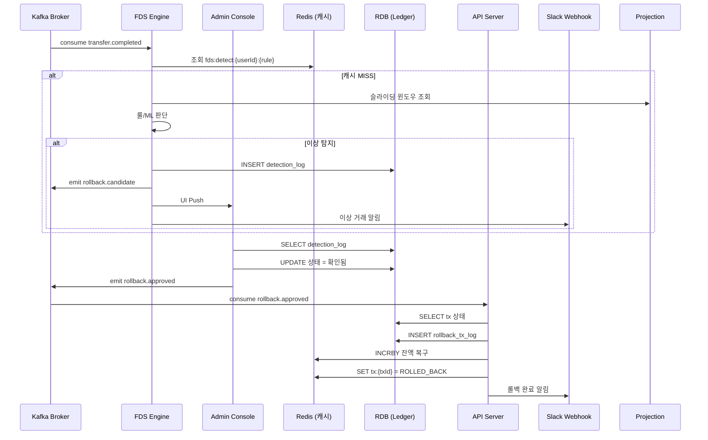
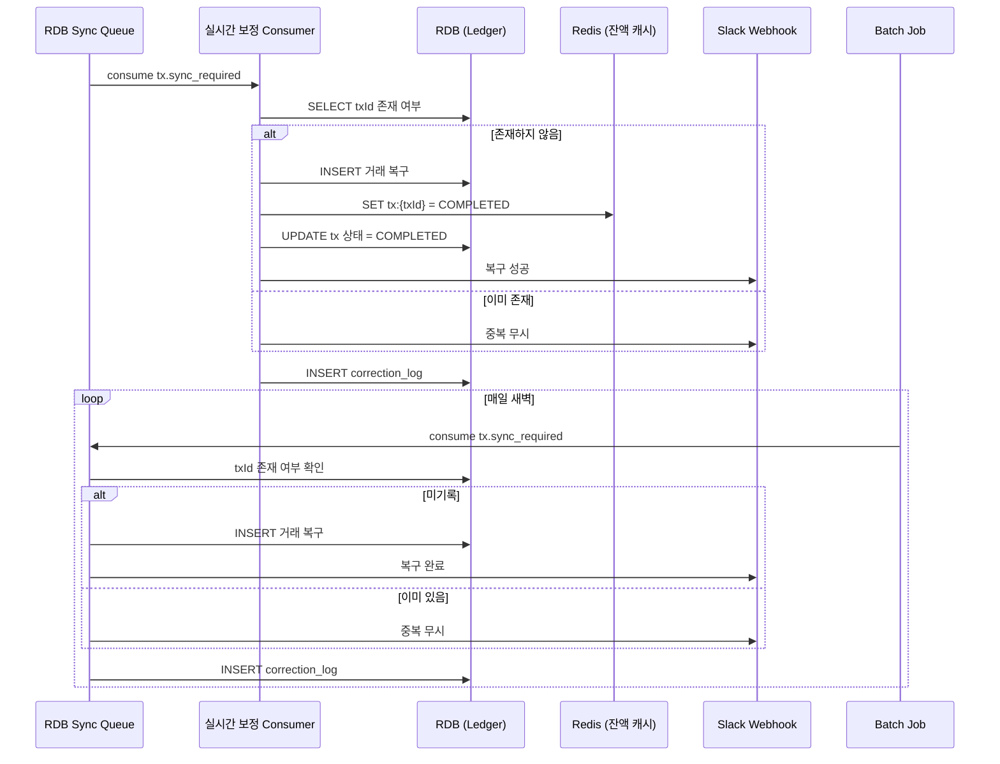
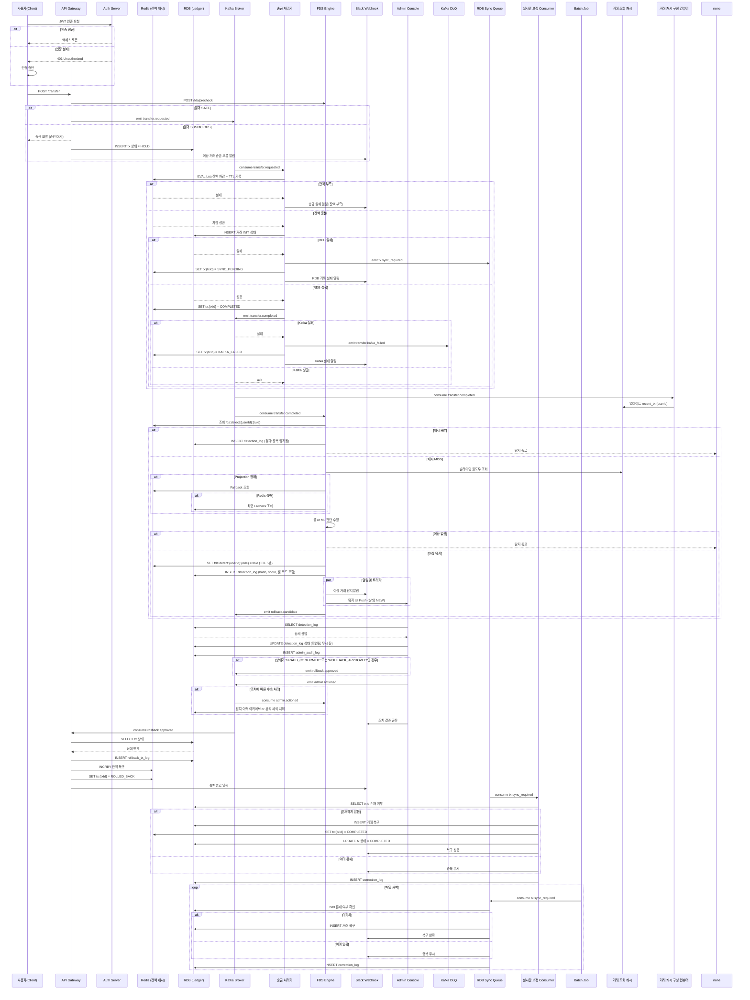

# 이상 거래 실시간 탐지 시스템 (FDS)

## 프로젝트 개요
사용자 거래에서 이상 징후를 실시간으로 감지하고, 관리자에게 알림과 리포트를 제공하는 FDS 시스템

## 목표

- Kafka 기반 이벤트 스트리밍 구조 설계
- Redis 기반 실시간 탐지 구조 구현
- 이상 거래 룰 기반 탐지 및 관리자 대시보드 구축
- 추후 AI 기반 탐지 확장이 가능한 형태로 설계
- 실시간성과 확장성을 고려한 아키텍처 실습

## 해결하고자 하는 문제

| 사례 | 설명 |
|------|------|
| 토스 | 3초 간격 5회 송금 시도 → 자동 차단 |
| 신한은행 | 새벽 2시 해외 결제 → 탐지 후 보류 |
| 카카오페이 | 낯선 기기에서 고액 결제 → 알림 후 차단 |

---

## 사용자 인증 + 송금 요청 초기

##  송금 처리, Redis 차감, RDB 기록, Kafka 송금 완료 이벤트 전파

## 송금 완료 후 이상 거래 탐지 흐름 및 운영자(관리자)의 조치 및 감사 처리

## 배치 - 실시간 보정(SyncConsumer)**과 일일 보정(Batch Job) 처리

## 전체 시스템 구성도

## 흐름 설명 

## 인증 – 거래의 전제 조건
사용자는 송금 요청 전에 JWT 기반 인증 과정을 거칩니다.  
인증에 성공한 사용자만 API 접근이 가능하며, 실패할 경우 모든 거래 흐름은 즉시 종료됩니다.  
이 단계는 FDS 탐지 대상의 user identity 확보를 위한 전제 조건입니다.  

## 송금 요청 – FDS 사전 탐지 기반 분기

사용자가 인증을 마치고 송금 요청을 하면,  
API 서버는 먼저 FDS의 `/fds/precheck` 엔드포인트를 호출하여  
이 거래가 이상 거래인지 판단한다.

FDS는 룰 기반 또는 ML 기반 탐지를 수행하고,  
이 결과가 "SAFE"인 경우에만 Kafka에 `transfer.requested` 이벤트를 발행하여 송금을 진행한다.

탐지 결과가 "SUSPICIOUS"인 경우에는 송금을 즉시 보류하고,  
트랜잭션 상태를 `HOLD`로 기록한 뒤 관리자 승인을 기다리게 된다.

Slack에는 송금 보류 알림이 전송되어 운영자가 즉시 확인할 수 있게 되며,  
사용자에게는 송금이 일시적으로 보류되었음을 안내하게 된다.

## 송금 처리기 – 트랜잭션 확정 주체
transfer.requested 이벤트를 받은 TxWorker는  
Redis에서 Lua 기반 잔액 차감을 수행합니다. (TTL 5분, txId 기반 key 저장)  

분기:  

잔액 부족 → Slack 알림 후 종료  

잔액 충분 → RDB에 거래를 INIT 상태로 저장 시도  

트랜잭션 처리 결과 – 복구 가능 구조 설계  
성공 시:  
txId를 Redis에 COMPLETED로 마킹  
Kafka에 transfer.completed 이벤트 발행  
이 이벤트는 FDS 탐지와 기타 후속 시스템에 전달됨  

실패 시:  
Redis에 tx:{txId} = SYNC_PENDING  
SyncQ에 tx.sync_required 이벤트 발행  
이 트랜잭션은 복구 대상으로 전환  
Slack으로 운영자에게 실패 상황을 전달함  

RDB 실패를 “영구 실패”가 아닌 “복구 대기 상태”로 전환함으로써,  
데이터 유실을 방지하고 운영자 감지 가능성을 높입니다.  

## Kafka Publish 실패 – 시스템 회복 포인트
transfer.completed 이벤트 발행 실패 시:  

DLQ로 transfer.kafka_failed 이벤트를 발행  

Slack을 통해 장애 상황을 즉시 알림  

이후 DLQ에 쌓인 이벤트는 SyncQ로 이동하여  
보정 대상으로 전환되며, Kafka 기반 장애 복구 루프에 자동 진입할 수 있도록 설계됩니다.  

## 이상 거래 탐지 – 로그 기반 탐지와 중복 제어
FDS 엔진은 transfer.completed 이벤트를 consume하고,  
캐시된 탐지 여부(fds:detect:{userId}:{rule})를 조회하여 중복 탐지를 방지합니다.  

캐시 MISS인 경우:  
최근 거래 슬라이딩 윈도우 조회 (Projection → Redis → fallback to RDB)  
룰 기반 또는 ML 판단 수행  

이상 탐지 발생 시:  
Redis에 탐지 캐시 저장 (5분 TTL)  
RDB에 detection_log 저장  
Slack + Admin UI에 탐지 알림 전달  
Kafka에 rollback.candidate 이벤트 발행 ( 관리자 승인 필요)

탐지 판단은 단순 TTL에 의존하지 않고, 로그 기반 중복 제어를 포함하여 설계됐습니다.  

## 승인 기반 롤백 – 이상 거래 복구
rollback.approved 이벤트를 consume한 API는
해당 트랜잭션 상태를 확인하고, 아래 행위를 수행합니다:  

rollback_tx_log 저장  

Redis에 잔액 복구 (INCRBY)  

tx 상태를 ROLLED_BACK으로 갱신  

Slack에 롤백 완료 알림 발송  

이 시점에서 트랜잭션은 복구 완료된 상태가 되며,  
운영자 및 탐지 기록에 모두 명시적으로 반영됩니다.  

## 운영자 조치 – 사람의 개입이 시스템에 반영됨  
Admin은 UI에서 탐지 로그를 조회하고,  
필요 시 탐지 상태를 변경합니다 (확인됨, 무시됨, 차단됨 등)  

모든 조치는 아래 흐름을 따릅니다:  

detection 상태 업데이트  

admin_audit_log 기록 (조치자, 사유, 시점)  

Kafka에 admin.actioned 이벤트 발행  

Slack으로 조치 결과 알림  

설계상 Admin 조치는 단순히 UI 변경이 아니라,  
이벤트 흐름에 개입되는 행위로 인식되도록 설계되어 있습니다.  

## 실시간 보정 – 상태 회복을 위한 자동 복구 루프
SyncQ에 쌓인 tx.sync_required 메시지를 SyncConsumer가 consume합니다.  

처리 로직:  

txId가 RDB에 존재하지 않으면 → 거래 복구 INSERT  

Redis에 tx:{txId} = COMPLETED 갱신  

Slack 알림 + correction_log 기록  

이 흐름은 Redis TTL 만료, DB 지연, Kafka 실패 등  
시스템 비정상 상황에도 트랜잭션 유실을 방지하는 핵심 보정 루틴입니다.  

## 정기 보정 – 누락 복구 보장
실시간 보정 외에도,  
Batch 작업이 매일 새벽 SyncQ를 재처리하여  
누락된 복구가 없는지 2차 확인합니다.  
correction_log를 통해 운영 이력도 남습니다.  

---

## 기술 스택
- Java 17 / Spring Boot / Spring Security / JPA (일부 영역)
- Kafka / Redis / MySQL
- Spring Batch (리포트)
- REST API + Swagger
- Docker, GitHub Actions, (Naver Cloud, AWS 등)
- React + Tailwind (Admin Dashboard)

## 기능 요약
| 범주       | 설명                          | 기술                          |
| -------- | --------------------------- | --------------------------- |
| 송금 API   | 사용자 인증 후 금액 검증 및 거래 생성      | REST API, JWT               |
| 잔액 확인    | Redis에서 Lua 기반 조건부 차감 처리    | Redis + Lua                 |
| 이벤트 발행   | Kafka에 거래 이벤트 비동기 전송        | Kafka Producer              |
| 실시간 탐지   | 룰 기반 탐지 로직 적용               | Kafka Consumer + Redis ZSET |
| 이상 거래 로그 | DB 저장 + Redis 캐시 + Slack 알림 | Redis + RDB + Webhook       |
| 관리자 대시보드 | 이상 거래 필터링/조회                | React + REST API            |
| 리포트 자동화  | 일간 통계 자동 생성 및 저장            | Spring Batch                |

### Kfaka 사용 이유
| 항목       | Kafka 기반 구조    | REST + DB       |
| -------- | -------------- | --------------- |
| 실시간성     | ms 단위 탐지 가능    | 배치 or 후처리       |
| 확장성      | 컨슈머 수평 확장      | DB 트랜잭션 병목      |
| 장애 복구    | offset 기반 재처리  | 수동 리커버리         |
| 후속 처리 분기 | 탐지, 알림 등 분기 가능 | 단일 처리 흐름        |
| AI 확장성   | 이벤트 replay 가능  | polling/dump 필요 |

### 잔액 동기화 구조 (Redis ↔ RDB)
- Redis에서 조건부 차감
- 성공 시 RDB 트랜잭션 처리
- 트랜잭션 실패 시 rollback_queue에 복구 항목 저장 
- 주기적으로 rollback queue 스캔 → Redis 복구 시도 
- Spring Batch로 Redis ↔ DB 정합성 비교 + 보정

### 트랜잭션 처리 흐름
클라이언트 → 송금 요청 (금액, 디바이스, IP 포함)
API 서버: 
- JWT 인증
- 금액/한도 검증
- Redis Lua로 잔액 차감 
- RDB에 송금 기록 
- Kafka 이벤트 발행

FDS 컨슈머:
- Redis에서 최근 거래 이력 조회
- 룰 기반 탐지
- 이상 시 Redis + DB 저장

관리자:
- 탐지 로그 UI 조회
- 상태별 필터/조치 가능

Spring Batch:
- 매일 이상 거래 리포트 생성 및 통계 저장

## 개발 일정

| 주차       | 작업 내용                 |
| -------- | --------------------- |
| 1\~2주차   | 요구사항 정리, ERD 설계       |
| 3\~4주차   | Auth, 송금 API 개발       |
| 5\~6주차   | Kafka 연동, 탐지 엔진 구현    |
| 7\~8주차   | 이상 거래 저장 + Admin API  |
| 9\~10주차  | 관리자 UI 구축             |
| 11주차     | 리포트 생성 + 배치 구축        |
| 12주차     | 로깅, Slack 연동          |
| 13\~14주차 | 배포, 성능 테스트            |
| +2주      | 리팩토링, 문서화, GitBook 정리 |
